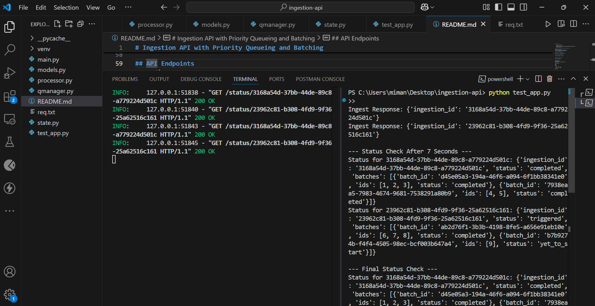

# Ingestion API with Priority Queueing and Batching

This project is a FastAPI-based asynchronous ingestion system. It allows clients to submit IDs with assigned priorities, which are then processed in fixed-size batches at a fixed rate limit. It ensures **priority-based processing**, **rate limiting**, and **batching** — ideal for handling high-throughput data ingestion.

---

## Features

- Accepts IDs along with priority levels (HIGH, MEDIUM, LOW)
- Batches processed with size = **3**
- Rate limited to **1 batch per 5 seconds**
- Maintains separate queues for different priorities
- Supports querying of ingestion and batch status

---

## Project Structure

ingestion-api/
│
├── main.py # FastAPI entry point
├── models.py # Request and response schemas
├── processor.py # Batch processor and background logic
├── queue_manager.py # Priority queue logic
├── state.py # Batch status tracking
├── test_app.py # Test script
├── requirements.txt # Python dependencies
├── test_screenshot.png # Screenshot of test run
└── README.md # Project documentation


## How to Run

1. Clone the repository:
   ```bash
   git clone https://github.com/your-username/your-repo-name.git
   cd your-repo-name

## Create a virtual environment and activate it:

python -m venv venv
source venv/bin/activate  # macOS/Linux
.\venv\Scripts\activate # windows

## Install dependencies:

pip install -r requirements.txt

## Start the FastAPI server:

uvicorn main:app --reload


## Run the test script:

python test_app.py


## API Endpoints
POST /ingest
Submit IDs with a priority level.

Request Body:

json
Copy
Edit
{
  "ids": [1, 2, 3],
  "priority": "HIGH"
}
Response:

json
Copy
Edit
{
  "ingestion_id": "abc123"
}
GET /status/{ingestion_id}
Fetch the batch-wise status of the submitted ingestion.

Response Example:

json
Copy
Edit
{
  "status": [
    {"batch_number": 1, "ids": [1, 2, 3], "status": "Completed"}
  ]
}

## Sample Test Run Output



